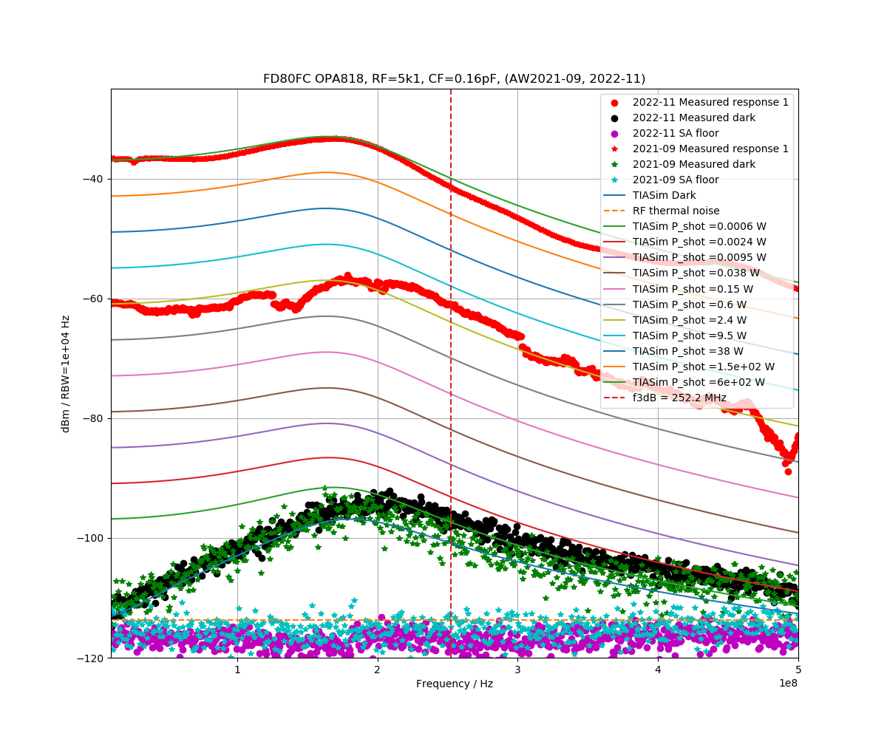

OPA818 with BUF602 output-buffer, for Fermionics FD80 photodiode
================================================================

Note pinout: 1 Anode, 2 Cathode, 3 Case - this differs from Hamamatsu S5973 and similar photodiodes.

Fermionics FD80FC fiber-coupled InGaAs photodiode with 5.1 kOhm transimpedance shows >250 MHz bandwidth. 
[TIASim model](https://github.com/aewallin/TIASim) fits the measurement data with a parasitic capacitance of 0.16 pF.

    
